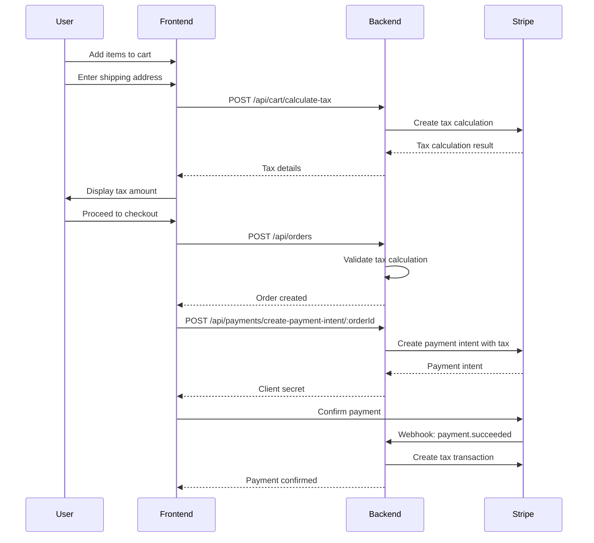

# Stripe Tax API Documentation

This document describes all API endpoints related to Stripe Tax calculation and management for the e-commerce platform.

## Table of Contents

1. [Overview](#overview)
2. [Authentication](#authentication)
3. [API Endpoints](#api-endpoints)
   - [Calculate Cart Tax](#1-calculate-cart-tax)
   - [Get Estimated Tax Rate](#2-get-estimated-tax-rate)
   - [Create Order (with Tax Validation)](#3-create-order-with-tax-validation)
   - [Create Payment Intent (with Tax)](#4-create-payment-intent-with-tax)
   - [Get Payment Status](#5-get-payment-status)
4. [Data Models](#data-models)
5. [Error Handling](#error-handling)
6. [Integration Flow](#integration-flow)
7. [Examples](#examples)

---

## Overview

Stripe Tax is fully integrated into the checkout and payment flow. Tax calculation is **required** before creating an order. The system automatically:

- Calculates tax based on shipping address
- Validates tax calculations before order creation
- Creates tax transactions for compliance
- Stores tax data with orders for reporting

### Key Features

- ✅ Real-time tax calculation using Stripe Tax API
- ✅ Tax validation before order creation
- ✅ Automatic tax transaction creation after payment
- ✅ Tax breakdown per product
- ✅ Support for guest and authenticated users
- ✅ Tax compliance tracking

---

## Authentication

Most endpoints support both authenticated and guest users:

- **Authenticated Users**: Include `Authorization: Bearer <token>` header
- **Guest Users**: Include `sessionId` in request body (for cart operations)

---

## API Endpoints

### 1. Calculate Cart Tax

Calculate tax for items in the cart based on shipping address.

**Endpoint:** `POST /api/cart/calculate-tax`

**Authentication:** Optional (works with or without auth)

**Request Body:**
```json
{
  "shippingAddress": {
    "street": "123 Main Street",
    "city": "New York",
    "state": "NY",
    "zipCode": "10001",
    "country": "US"
  },
  "sessionId": "session_123" // Required for guest users
}
```

**Request Parameters:**

| Field | Type | Required | Description |
|-------|------|----------|-------------|
| `shippingAddress.street` | string | Yes | Street address |
| `shippingAddress.city` | string | Yes | City name |
| `shippingAddress.state` | string | Yes | State code (e.g., "NY", "CA") |
| `shippingAddress.zipCode` | string | Yes | ZIP/Postal code |
| `shippingAddress.country` | string | No | Country code (defaults to "US") |
| `sessionId` | string | Conditional | Required for guest users |

**Success Response (200 OK):**
```json
{
  "success": true,
  "message": "Tax calculated successfully",
  "cart": {
    "_id": "cart_id",
    "items": [...],
    "subtotal": 150.00,
    "shippingCost": 10.00,
    "total": 172.50,
    "stripeTaxCalculationId": "taxcalc_1234567890",
    "stripeTaxData": {
      "totalTax": 12.50,
      "taxBreakdown": [
        {
          "productId": "product_id_1",
          "taxAmount": 8.50,
          "taxRate": 8.5,
          "jurisdiction": "New York, NY"
        },
        {
          "productId": "product_id_2",
          "taxAmount": 4.00,
          "taxRate": 8.5,
          "jurisdiction": "New York, NY"
        }
      ],
      "calculatedAt": "2024-01-15T10:30:00.000Z",
      "isValid": true
    },
    "tempShippingAddress": {
      "street": "123 Main Street",
      "city": "New York",
      "state": "NY",
      "zipCode": "10001",
      "country": "US"
    }
  },
  "taxDetails": {
    "totalTax": 12.50,
    "taxBreakdown": [
      {
        "productId": "product_id_1",
        "taxAmount": 8.50,
        "taxRate": 8.5,
        "jurisdiction": "New York, NY"
      },
      {
        "productId": "product_id_2",
        "taxAmount": 4.00,
        "taxRate": 8.5,
        "jurisdiction": "New York, NY"
      }
    ],
    "calculationId": "taxcalc_1234567890",
    "jurisdiction": "New York, NY"
  }
}
```

**Error Responses:**

| Status Code | Error Response |
|-------------|----------------|
| 400 | `{ "success": false, "message": "Shipping address with zip code is required for tax calculation" }` |
| 404 | `{ "success": false, "message": "Cart not found or empty" }` |
| 400 | `{ "success": false, "message": "Failed to calculate tax", "error": "Error details" }` |
| 500 | `{ "success": false, "message": "Server error", "error": "Error message" }` |

**Example cURL:**
```bash
curl -X POST https://api.example.com/api/cart/calculate-tax \
  -H "Content-Type: application/json" \
  -H "Authorization: Bearer YOUR_TOKEN" \
  -d '{
    "shippingAddress": {
      "street": "123 Main Street",
      "city": "New York",
      "state": "NY",
      "zipCode": "10001",
      "country": "US"
    }
  }'
```

**Example JavaScript:**
```javascript
const calculateTax = async (shippingAddress, sessionId = null) => {
  const response = await fetch('/api/cart/calculate-tax', {
    method: 'POST',
    headers: {
      'Content-Type': 'application/json',
      ...(authToken && { 'Authorization': `Bearer ${authToken}` })
    },
    body: JSON.stringify({
      shippingAddress,
      ...(sessionId && { sessionId })
    })
  });

  const data = await response.json();
  
  if (!data.success) {
    throw new Error(data.message);
  }

  return data;
};
```

---

### 2. Get Estimated Tax Rate

Get an estimated tax rate for a location without requiring a cart. Useful for displaying tax estimates before checkout.

**Endpoint:** `GET /api/cart/estimated-tax-rate`

**Authentication:** Not required

**Query Parameters:**

| Parameter | Type | Required | Description |
|-----------|------|----------|-------------|
| `zipCode` | string | Yes | ZIP/Postal code |
| `state` | string | Yes | State code (e.g., "NY", "CA") |
| `country` | string | No | Country code (defaults to "US") |

**Success Response (200 OK):**
```json
{
  "success": true,
  "estimatedTaxRate": "8.50",
  "jurisdiction": "New York, NY",
  "location": "NY, 10001"
}
```

**Error Responses:**

| Status Code | Error Response |
|-------------|----------------|
| 400 | `{ "success": false, "message": "Zip code and state are required" }` |
| 400 | `{ "success": false, "message": "Failed to calculate estimated tax rate", "error": "Error details" }` |
| 500 | `{ "success": false, "message": "Server error", "error": "Error message" }` |

**Example cURL:**
```bash
curl "https://api.example.com/api/cart/estimated-tax-rate?zipCode=10001&state=NY&country=US"
```

**Example JavaScript:**
```javascript
const getEstimatedTaxRate = async (zipCode, state, country = 'US') => {
  const response = await fetch(
    `/api/cart/estimated-tax-rate?zipCode=${zipCode}&state=${state}&country=${country}`
  );

  const data = await response.json();
  
  if (!data.success) {
    throw new Error(data.message);
  }

  return data;
};
```

---

### 3. Create Order (with Tax Validation)

Create a new order. **Requires tax calculation to be completed first.**

**Endpoint:** `POST /api/orders`

**Authentication:** Required

**Request Body:**
```json
{
  "cartId": "cart_id",
  "shippingAddress": {
    "fullName": "John Doe",
    "street": "123 Main Street",
    "city": "New York",
    "state": "NY",
    "zipCode": "10001",
    "country": "US",
    "phoneNumber": "+1234567890",
    "deliveryInstructions": "Leave at door"
  },
  "billingAddress": {
    // Same structure as shippingAddress (optional, defaults to shippingAddress)
  },
  "paymentMethod": "stripe",
  "customerNotes": "Please handle with care"
}
```

**Request Parameters:**

| Field | Type | Required | Description |
|-------|------|----------|-------------|
| `cartId` | string | Yes | Cart ID |
| `shippingAddress` | object | Yes | Complete shipping address |
| `billingAddress` | object | No | Billing address (defaults to shipping) |
| `paymentMethod` | string | Yes | Payment method (e.g., "stripe") |
| `customerNotes` | string | No | Customer notes |

**Success Response (201 Created):**
```json
{
  "success": true,
  "message": "Order created successfully. Proceed to payment.",
  "order": {
    "_id": "order_id",
    "user": "user_id",
    "orderItems": [...],
    "subtotal": 150.00,
    "shippingCost": 10.00,
    "totalPrice": 172.50,
    "stripeTaxData": {
      "calculationId": "taxcalc_1234567890",
      "totalTaxAmount": 12.50,
      "taxBreakdown": [
        {
          "productId": "product_id_1",
          "itemName": "Product Name",
          "taxAmount": 8.50,
          "taxRate": 8.5,
          "jurisdiction": "New York, NY",
          "taxType": "sales_tax"
        }
      ],
      "jurisdiction": "New York, NY",
      "taxCalculatedAt": "2024-01-15T10:30:00.000Z",
      "isValid": true
    },
    "orderStatus": "pending",
    "paymentStatus": "pending",
    "isPaid": false
  },
  "paymentRequired": true,
  "taxDetails": {
    "totalTax": 12.50,
    "taxCalculationId": "taxcalc_1234567890",
    "jurisdiction": "New York, NY"
  }
}
```

**Error Responses:**

| Status Code | Error Response |
|-------------|----------------|
| 400 | `{ "success": false, "message": "Tax calculation required. Please calculate tax for your cart before creating an order." }` |
| 400 | `{ "success": false, "message": "Shipping address required for tax calculation. Please update your cart with shipping address." }` |
| 400 | `{ "success": false, "message": "Tax calculation expired or invalid. Please recalculate tax for your cart.", "error": "Error details" }` |
| 401 | `{ "success": false, "message": "User authentication required to create an order" }` |
| 404 | `{ "success": false, "message": "Cart not found" }` |
| 500 | `{ "success": false, "message": "Server error", "error": "Error message" }` |

**Important Notes:**

- Tax calculation **must** be completed before creating an order
- Tax calculation must be valid and not expired
- Shipping address in cart must match the order shipping address

**Example JavaScript:**
```javascript
const createOrder = async (orderData) => {
  const response = await fetch('/api/orders', {
    method: 'POST',
    headers: {
      'Content-Type': 'application/json',
      'Authorization': `Bearer ${authToken}`
    },
    body: JSON.stringify(orderData)
  });

  const data = await response.json();
  
  if (!data.success) {
    // Handle tax-related errors
    if (data.message.includes('Tax calculation')) {
      // Recalculate tax and retry
      await calculateTax(orderData.shippingAddress);
      return createOrder(orderData);
    }
    throw new Error(data.message);
  }

  return data;
};
```

---

### 4. Create Payment Intent (with Tax)

Create a Stripe payment intent for an order. **Requires order to have valid tax calculation.**

**Endpoint:** `POST /api/payments/create-payment-intent/:orderId`

**Authentication:** Required

**URL Parameters:**

| Parameter | Type | Required | Description |
|-----------|------|----------|-------------|
| `orderId` | string | Yes | Order ID |

**Request Body:** None (order ID is in URL)

**Success Response (200 OK):**
```json
{
  "success": true,
  "clientSecret": "pi_1234567890_secret_...",
  "paymentIntentId": "pi_1234567890",
  "amount": 172.50,
  "taxDetails": {
    "totalTax": 12.50,
    "taxCalculationId": "taxcalc_1234567890",
    "jurisdiction": "New York, NY"
  }
}
```

**Error Responses:**

| Status Code | Error Response |
|-------------|----------------|
| 400 | `{ "success": false, "message": "Order missing tax calculation. Please recreate the order." }` |
| 400 | `{ "success": false, "message": "Tax calculation expired or invalid. Please recreate the order.", "error": "Error details" }` |
| 400 | `{ "success": false, "message": "Order is already paid" }` |
| 404 | `{ "success": false, "message": "Order not found" }` |
| 403 | `{ "success": false, "message": "Not authorized to make payment for this order" }` |
| 500 | `{ "success": false, "message": "Server error", "error": "Error message" }` |

**Example JavaScript:**
```javascript
const createPaymentIntent = async (orderId) => {
  const response = await fetch(`/api/payments/create-payment-intent/${orderId}`, {
    method: 'POST',
    headers: {
      'Authorization': `Bearer ${authToken}`
    }
  });

  const data = await response.json();
  
  if (!data.success) {
    throw new Error(data.message);
  }

  // Use clientSecret with Stripe.js
  const stripe = Stripe('pk_test_...');
  const result = await stripe.confirmCardPayment(data.clientSecret, {
    payment_method: {
      card: cardElement,
      billing_details: {
        name: 'John Doe'
      }
    }
  });

  return result;
};
```

---

### 5. Get Payment Status

Get the status of a payment intent, including tax information.

**Endpoint:** `GET /api/payments/status/:paymentIntentId`

**Authentication:** Required

**URL Parameters:**

| Parameter | Type | Required | Description |
|-----------|------|----------|-------------|
| `paymentIntentId` | string | Yes | Stripe Payment Intent ID |

**Success Response (200 OK):**
```json
{
  "success": true,
  "status": "succeeded",
  "paymentIntent": {
    "id": "pi_1234567890",
    "amount": 17250,
    "currency": "usd",
    "status": "succeeded",
    "metadata": {
      "orderId": "order_id",
      "userId": "user_id",
      "taxCalculationId": "taxcalc_1234567890"
    }
  },
  "taxCalculationId": "taxcalc_1234567890"
}
```

**Error Responses:**

| Status Code | Error Response |
|-------------|----------------|
| 400 | `{ "success": false, "message": "Payment intent ID is required" }` |
| 400 | `{ "success": false, "message": "Failed to retrieve payment intent", "error": "Error details" }` |
| 403 | `{ "success": false, "message": "Not authorized to view this payment" }` |
| 500 | `{ "success": false, "message": "Server error", "error": "Error message" }` |

**Example JavaScript:**
```javascript
const getPaymentStatus = async (paymentIntentId) => {
  const response = await fetch(`/api/payments/status/${paymentIntentId}`, {
    headers: {
      'Authorization': `Bearer ${authToken}`
    }
  });

  const data = await response.json();
  
  if (!data.success) {
    throw new Error(data.message);
  }

  return data;
};
```

---

## Data Models

### Tax Breakdown Object

```typescript
interface TaxBreakdown {
  productId: string;        // Product ID
  itemName?: string;        // Product name (in order tax breakdown)
  taxAmount: number;        // Tax amount in dollars
  taxRate: number;          // Tax rate percentage
  jurisdiction: string;     // Tax jurisdiction (e.g., "New York, NY")
  taxType?: string;         // Tax type (e.g., "sales_tax")
}
```

### Tax Details Object

```typescript
interface TaxDetails {
  totalTax: number;                    // Total tax amount in dollars
  taxBreakdown: TaxBreakdown[];        // Per-item tax breakdown
  calculationId: string;               // Stripe tax calculation ID
  jurisdiction: string;                // Primary jurisdiction
}
```

### Stripe Tax Data (in Cart/Order)

```typescript
interface StripeTaxData {
  calculationId: string;               // Stripe tax calculation ID
  transactionId?: string;              // Tax transaction ID (set after payment)
  totalTax: number;                    // Total tax amount (cart)
  totalTaxAmount: number;              // Total tax amount (order)
  taxBreakdown: TaxBreakdown[];        // Per-item tax breakdown
  jurisdiction: string;                // Tax jurisdiction
  taxCalculatedAt: Date;               // When tax was calculated
  isValid: boolean;                    // Whether tax calculation is valid
}
```

---

## Error Handling

### Common Error Scenarios

1. **Tax Not Calculated**
   - **Error:** `"Tax calculation required. Please calculate tax for your cart before creating an order."`
   - **Solution:** Call `/api/cart/calculate-tax` before creating order

2. **Tax Calculation Expired**
   - **Error:** `"Tax calculation expired or invalid. Please recalculate tax for your cart."`
   - **Solution:** Recalculate tax using `/api/cart/calculate-tax`

3. **Missing Shipping Address**
   - **Error:** `"Shipping address with zip code is required for tax calculation"`
   - **Solution:** Provide complete shipping address with zip code

4. **Invalid Address**
   - **Error:** `"Failed to calculate tax"` with Stripe error details
   - **Solution:** Verify address format and ensure it's a valid US address

### Error Response Format

All errors follow this format:

```json
{
  "success": false,
  "message": "Human-readable error message",
  "error": "Technical error details (optional)"
}
```

---

## Integration Flow

### Complete Checkout Flow



### Step-by-Step Integration

1. **Cart Page**
   - User adds items to cart
   - Display subtotal, shipping, tax (if calculated), and total

2. **Shipping Address Form**
   - User enters shipping address
   - On zip code/state change, call `/api/cart/calculate-tax`
   - Display calculated tax amount
   - Update cart total

3. **Checkout Review**
   - Display order summary with tax breakdown
   - Show tax jurisdiction
   - Verify tax is calculated before allowing order creation

4. **Order Creation**
   - Call `/api/orders` with cart ID and shipping address
   - Backend validates tax calculation exists and is valid
   - Order created with tax data

5. **Payment**
   - Call `/api/payments/create-payment-intent/:orderId`
   - Use `clientSecret` with Stripe.js to confirm payment
   - Backend automatically creates tax transaction on success

---

## Examples

### Complete Checkout Example

```javascript
// Complete checkout flow with tax calculation
async function completeCheckout(cartId, shippingAddress, paymentMethod) {
  try {
    // Step 1: Calculate tax
    console.log('Calculating tax...');
    const taxResult = await fetch('/api/cart/calculate-tax', {
      method: 'POST',
      headers: {
        'Content-Type': 'application/json',
        'Authorization': `Bearer ${authToken}`
      },
      body: JSON.stringify({ shippingAddress })
    });
    
    const taxData = await taxResult.json();
    if (!taxData.success) {
      throw new Error(taxData.message);
    }
    
    console.log('Tax calculated:', taxData.taxDetails.totalTax);
    
    // Step 2: Create order
    console.log('Creating order...');
    const orderResult = await fetch('/api/orders', {
      method: 'POST',
      headers: {
        'Content-Type': 'application/json',
        'Authorization': `Bearer ${authToken}`
      },
      body: JSON.stringify({
        cartId,
        shippingAddress,
        paymentMethod: 'stripe'
      })
    });
    
    const orderData = await orderResult.json();
    if (!orderData.success) {
      throw new Error(orderData.message);
    }
    
    console.log('Order created:', orderData.order._id);
    
    // Step 3: Create payment intent
    console.log('Creating payment intent...');
    const paymentResult = await fetch(
      `/api/payments/create-payment-intent/${orderData.order._id}`,
      {
        method: 'POST',
        headers: {
          'Authorization': `Bearer ${authToken}`
        }
      }
    );
    
    const paymentData = await paymentResult.json();
    if (!paymentData.success) {
      throw new Error(paymentData.message);
    }
    
    console.log('Payment intent created:', paymentData.paymentIntentId);
    
    // Step 4: Confirm payment with Stripe
    const stripe = Stripe('pk_test_...');
    const { error, paymentIntent } = await stripe.confirmCardPayment(
      paymentData.clientSecret,
      {
        payment_method: {
          card: cardElement,
          billing_details: {
            name: shippingAddress.fullName,
            address: {
              line1: shippingAddress.street,
              city: shippingAddress.city,
              state: shippingAddress.state,
              postal_code: shippingAddress.zipCode,
              country: shippingAddress.country
            }
          }
        }
      }
    );
    
    if (error) {
      throw new Error(error.message);
    }
    
    console.log('Payment confirmed:', paymentIntent.status);
    return { order: orderData.order, paymentIntent };
    
  } catch (error) {
    console.error('Checkout error:', error);
    throw error;
  }
}
```

### React Hook Example

```javascript
import { useState, useEffect } from 'react';

function useTaxCalculation(shippingAddress) {
  const [taxDetails, setTaxDetails] = useState(null);
  const [loading, setLoading] = useState(false);
  const [error, setError] = useState(null);

  useEffect(() => {
    if (!shippingAddress?.zipCode || !shippingAddress?.state) {
      setTaxDetails(null);
      return;
    }

    const calculateTax = async () => {
      setLoading(true);
      setError(null);
      
      try {
        const response = await fetch('/api/cart/calculate-tax', {
          method: 'POST',
          headers: {
            'Content-Type': 'application/json',
            'Authorization': `Bearer ${authToken}`
          },
          body: JSON.stringify({ shippingAddress })
        });

        const data = await response.json();
        
        if (data.success) {
          setTaxDetails(data.taxDetails);
        } else {
          setError(data.message);
        }
      } catch (err) {
        setError(err.message);
      } finally {
        setLoading(false);
      }
    };

    // Debounce tax calculation
    const timeoutId = setTimeout(calculateTax, 500);
    return () => clearTimeout(timeoutId);
  }, [shippingAddress]);

  return { taxDetails, loading, error };
}

// Usage in component
function CheckoutForm() {
  const [shippingAddress, setShippingAddress] = useState({});
  const { taxDetails, loading, error } = useTaxCalculation(shippingAddress);

  return (
    <div>
      <ShippingAddressForm onChange={setShippingAddress} />
      
      {loading && <div>Calculating tax...</div>}
      {error && <div className="error">{error}</div>}
      {taxDetails && (
        <div>
          <p>Tax: ${taxDetails.totalTax.toFixed(2)}</p>
          <p>Jurisdiction: {taxDetails.jurisdiction}</p>
        </div>
      )}
    </div>
  );
}
```

---

## Testing

### Test Scenarios

1. **Normal Flow**
   - Add items to cart
   - Enter valid US shipping address
   - Calculate tax successfully
   - Create order
   - Complete payment

2. **Address Change**
   - Calculate tax for one address
   - Change shipping address
   - Tax recalculates automatically
   - New tax amount displayed

3. **Missing Tax**
   - Try to create order without calculating tax
   - Should receive error: "Tax calculation required"

4. **Expired Tax**
   - Calculate tax
   - Wait for expiration (or manually invalidate)
   - Try to create order
   - Should receive error: "Tax calculation expired"

5. **Invalid Address**
   - Enter invalid zip code
   - Should receive error from Stripe

6. **Guest User**
   - Add items to cart as guest
   - Calculate tax with sessionId
   - Create order after login

---

## Support

For issues or questions:

1. Check error messages for specific guidance
2. Verify Stripe Tax is enabled in Stripe Dashboard
3. Ensure business origin address is configured
4. Check tax registrations for relevant states
5. Review Stripe Tax documentation: https://docs.stripe.com/tax

---

## Changelog

### Version 1.0.0 (Current)
- ✅ Full Stripe Tax integration
- ✅ Tax calculation before order creation
- ✅ Tax transaction creation after payment
- ✅ Tax compliance tracking
- ✅ Support for guest and authenticated users
- ✅ Real-time tax calculation
- ✅ Tax breakdown per product

---

**Last Updated:** January 2024
**API Version:** 1.0.0


